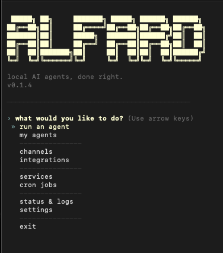
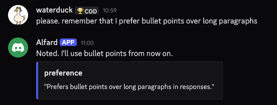

<div align="center">

[](https://pypi.org/project/alfard/)
[](https://www.npmjs.com/package/alfard-cli)
[](https://www.python.org/downloads/)
[](LICENSE)
[]()

**A local AI agent runtime. You own it. You control it. It never acts without you.**

[Quick Start](#quick-start) · [Features](#features) · [Examples](#what-can-you-build-with-it) · [Security](#security) · [Roadmap](#roadmap)

<br>


</div>

---

> 📖 **Full documentation is coming soon.** For now, everything you need is in this README.

---

## What is Alfard?

Alfard runs AI agents on your machine. Each agent has its own persistent memory, connected to your real tools — Gmail, Notion, GitHub, Slack, Linear — and talks to you from your terminal, Telegram, Discord, or Slack simultaneously.

Before anything irreversible happens, it stops and asks you. That confirmation is logged. Nothing runs silently. Nothing leaves your machine.

---

## What can you build with it?

<details>
<summary><strong>🔍 PR review pipeline</strong></summary>

Connect **GitHub + Slack + Notion**. Set a cron job every hour. When a new pull request lands, your agent reads the diff, reviews the code, and posts a structured audit to Slack — what changed, what looks risky, what questions it has. You reply once to approve. The agent creates a tracked task in Notion automatically.

</details>

<details>
<summary><strong>📧 Client enquiry intake</strong></summary>

Connect **Gmail + Notion**. When clients send unformatted requests, your agent reads the email, extracts key details, and formats them into a clean entry. Before touching anything, it sends you an approval request in Slack with exactly what it's about to log. One confirmation — it writes the record.

</details>

<details>
<summary><strong>📋 Daily engineering standup brief</strong></summary>

Connect **GitHub + Linear + Slack**. Schedule at 8am every weekday. It reads all PRs opened in the last 24 hours, checks which Linear tickets moved, and posts a concise brief to your team channel. Your team starts the day with context instead of a catch-up call.

</details>

<details>
<summary><strong>📝 Release notes from merged PRs</strong></summary>

Connect **GitHub + Notion**. Tell your agent: *"summarise every PR merged to main since the last tag and draft release notes."* It reads the full diff history, groups changes by type — features, fixes, breaking — and drafts a structured Notion page. You review, edit, publish.

</details>

---

## Quick start

### The fast way (recommended)

If you have Node.js installed:

```bash
npx alfard-cli
```

That's it. Alfard installs itself and launches immediately. No Python setup, no pipx, nothing else.

> Don't have Node.js? Download it from [nodejs.org](https://nodejs.org) — it takes 2 minutes. Or use the manual install below.

---

### Manual install

<details>
<summary>Step 1 — Install Python 3.11+</summary>

<details>
<summary><strong>🍎 macOS</strong></summary>

The easiest way is [Homebrew](https://brew.sh). If you don't have it, paste this in your terminal first:

```bash
/bin/bash -c "$(curl -fsSL https://raw.githubusercontent.com/Homebrew/install/HEAD/install.sh)"
```

Then install Python:

```bash
brew install python@3.11
```

Verify it worked:

```bash
python3 --version   # should say Python 3.11.x or higher
```

</details>

<details>
<summary><strong>🪟 Windows</strong></summary>

1. Go to [python.org/downloads](https://www.python.org/downloads/) and download the latest Python 3.11+ installer
2. Run it — **tick "Add Python to PATH"** before clicking Install
3. Open a new Command Prompt and verify:

```cmd
python --version   # should say Python 3.11.x or higher
```

</details>

<details>
<summary><strong>🐧 Linux</strong></summary>

```bash
sudo apt update && sudo apt install python3.11 python3.11-venv python3-pip -y
```

For other distros, use your package manager (`dnf`, `pacman`, etc.) or [pyenv](https://github.com/pyenv/pyenv).

Verify:

```bash
python3 --version   # should say Python 3.11.x or higher
```

</details>

</details>

<details>
<summary>Step 2 — Install pipx</summary>

`pipx` installs Python CLI tools in their own isolated environment. It's the cleanest way to install Alfard.

<details>
<summary><strong>🍎 macOS</strong></summary>

```bash
brew install pipx
pipx ensurepath
```

Then **close and reopen your terminal** so the path update takes effect.

</details>

<details>
<summary><strong>🪟 Windows</strong></summary>

```cmd
pip install pipx
pipx ensurepath
```

Then **close and reopen your terminal**.

</details>

<details>
<summary><strong>🐧 Linux</strong></summary>

```bash
pip install pipx
pipx ensurepath
```

Then **close and reopen your terminal**, or run `source ~/.bashrc`.

</details>

</details>

<details>
<summary>Step 3 — Install Alfard</summary>

```bash
pipx install alfard
```

</details>

---

### Step 4 — Run setup

```bash
alfard setup
```

This walks you through 6 steps: choosing your LLM provider, adding your API key, connecting integrations, creating your first agent, adding skills, and reviewing everything. Takes about 3 minutes.

> **No LLM API key?** Alfard works with [Ollama](https://ollama.com) — fully local, no account needed. Pick "Ollama" during setup.

---

### Step 5 — Open Alfard

```bash
alfard
```

That's it. Navigate everything with arrow keys — your agents, channels, integrations, skills, memory, cron jobs, and settings. No commands to memorise.



Select your agent from **my agents**, choose **run**, and Alfard loads its memory, connects all configured channels, and starts listening. Talk to it in the terminal — or from Telegram, Discord, and Slack at the same time. Same agent, same memory, same rules everywhere.

> **Want it running 24/7?** Go to **settings → service** in the menu and install your agent as a background service. It will start on boot, stay alive on all connected channels, and recover automatically if it crashes — no terminal needed, no elevation required.

---

### Power user commands

If you prefer the terminal directly:

```bash
alfard run <agent>                # run an agent
alfard headless <agent>           # channels only — for VPS / homelab
alfard service install <agent>    # auto-start on boot, crash recovery
alfard connect <name>             # connect an integration
alfard channel connect <name>     # connect a channel
alfard log                        # full audit trail
alfard cron                       # manage scheduled tasks
alfard doctor                     # diagnose setup issues
```

> Full CLI reference → **docs coming soon**

---

## Features

| | Feature | What it does |
|---|---|---|
| 🔒 | **Approval gate** | Halts before every irreversible action. You see full details — tool, arguments, source. Type `y` or `n`. Logged either way. Cannot be bypassed. |
| 🔑 | **Encrypted credentials** | API keys stored as `~/.alfard/.env.enc` — Fernet-encrypted, key lives in your OS keychain. Never in plaintext. |
| 🧠 | **Typed persistent memory** | 10 categories, valenced, scored by relevance and importance. Persists across every session. |
| 🔄 | **Reflect cycle** | Every 20 messages, Alfard proposes memory improvements. You approve or reject each one before it takes effect. |
| 🛡️ | **3-layer injection protection** | Output sanitiser + behavioural gate + strip safety net — web content cannot hijack your agent. |
| 📋 | **Full audit trail** | Every LLM call, tool execution, gate decision, and session event logged to `audit.jsonl` with UTC timestamps. |
| 📡 | **Multi-channel** | Terminal, Telegram, Discord, and Slack simultaneously. Approval gate adapts per channel — inline keyboard on Telegram, button embed on Discord. |
| ⚙️ | **Service mode** | Install your agent as a background service — it runs 24/7 on all connected channels, even when you close your terminal. No elevation required on any platform. `alfard service install/start/stop/status/logs` |
| ⏱️ | **Cron jobs** | Schedule any agent task on a timer. Full cron UI via `alfard cron`. |
| 💬 | **Slash commands** | `/new` `/remember` `/status` `/skills` `/reset` `/model` `/help` — in every channel. |
| 🧩 | **Skills system** | Markdown-defined, per-agent, composable. Comes with 7 built-in. Add your own in `~/.alfard/skills/`. |
| 🌐 | **Any LLM** | OpenRouter, OpenAI, Anthropic, Ollama, LM Studio. Switch at any time. Your data never has to leave your machine. |
| 🖥️ | **Interactive menu** | `alfard` opens a full arrow-key menu. Agents, channels, integrations, skills, memory, settings — everything in one place. |

---

## Channels

| Channel | Status | How to connect |
|---|---|---|
| Terminal | ✅ Built-in | Always available |
| Telegram | ✅ Stable | `alfard channel connect telegram` |
| Discord | ✅ Stable | `alfard channel connect discord` |
| Slack | ✅ Stable | `alfard channel connect slack` |

---

## Integrations

| Integration | Status | How to connect |
|---|---|---|
| Notion | ✅ Stable | `alfard connect notion` |
| GitHub | ✅ Stable | `alfard connect github` |
| Linear | ✅ Stable | `alfard connect linear` |
| Web search (DDG / Brave / SearXNG) | ✅ Stable | Enabled during setup |
| Gmail | ⚠️ Experimental | `alfard connect gmail` — OAuth via `gogcli`, auto-installed |
| Google Drive | ⚠️ Experimental | `alfard connect gdrive` — OAuth via `gogcli`, auto-installed |

---

## Supported LLM providers

| Provider | Runs locally | Models |
|---|---|---|
| OpenRouter | No | `openrouter/auto` (default) · `google/gemini-3-flash-preview` · `anthropic/claude-sonnet-4-6` · any model on the platform |
| OpenAI | No | `gpt-4o` (default) · `gpt-4o-mini` · `o4-mini` · custom |
| Anthropic | No | `claude-sonnet-4-6` (default) · `claude-opus-4-7` · `claude-haiku-4-5-20251001` · custom |
| Ollama | ✅ Yes | `llama3.2` · `mistral` · `qwen2.5-coder` · any local model |
| LM Studio | ✅ Yes | Any model loaded in LM Studio |

---

## Memory

Every agent has a persistent `brain.db` that survives across sessions. Memory is typed into 10 categories:

`fact` · `preference` · `goal` · `project_state` · `procedure` · `mistake` · `tool_pattern` · `decision` · `person` · `constraint`

Each memory has a confidence score, importance weight, and valence. Retrieval blends relevance, recency, and importance — `project_state` always surfaces first.

**Reflect** fires on three triggers — every 20 messages, every 30 minutes idle, every 10 sessions — and proposes improvements based on patterns it finds. You approve or reject each proposal before it writes. Rejected proposals never come back.

After every confirmed write, a notification appears in the active channel showing exactly what was remembered and as what type.



---

## Security

Security is the architecture, not a feature layer. Full model in [SECURITY.md](SECURITY.md).

- **Approval gate** — every irreversible action, every channel, cannot be bypassed
- **Encrypted credentials** — Fernet + OS keychain, automatic plaintext migration on upgrade
- **3-layer prompt injection protection** — sanitiser + behavioural gate + strip safety net. All sanitised content is source-attributed before it enters LLM context
- **Sandbox executor** — every tool call runs in an isolated OS subprocess with a hard 30-second timeout. Tools cannot block the runtime
- **Tool registry + classifier** — every tool is registered as reversible or irreversible at startup. Unregistered tool calls are structurally impossible, not just discouraged
- **Worktree isolation** — all agent file operations are directed to a disposable git branch, keeping your working tree untouched
- **Full audit trail** — every event logged, credentials never appear in arguments
- **Memory secret blocking** — API keys, tokens, passwords blocked before any `brain.db` write
- **Channel allowlists** — Telegram and Discord require explicit user/guild whitelists
- **No telemetry** — nothing phones home, ever

To report a vulnerability, see [SECURITY.md](SECURITY.md#responsible-disclosure). Please do not open a public issue.

---

## Creating an agent

Run `alfard` → **create a new agent**. The soul wizard walks through 5 sections — identity, expertise, communication style, uncertainty behaviour, and optional context about you. Takes about 2 minutes.

Or write `soul.md` directly — it's plain markdown:

```markdown
# postman

## Purpose
You manage email. You read, triage, draft, and send via Gmail.
You never send without explicit user approval.

## Personality
Efficient and direct. Summarise threads in bullet points.

## Rules
- Always show a draft before calling gmail_send_message.
- Mark threads read only after the user confirms.
- Flag anything from investors or customers as high priority.
```

---

## Architecture

All user data lives in `~/.alfard/` — nothing is ever written to the Alfard repo or install directory.

```
~/.alfard/
├── .env.enc               # API keys — Fernet-encrypted, key in OS keychain
├── config/
│   ├── alfard.yaml        # provider, model, approval gate settings
│   └── integrations.yaml  # connected channels and integrations
├── agents/
│   └── <name>/
│       ├── soul.md        # agent personality and rules
│       ├── skills.yaml    # active skills for this agent
│       ├── brain.db       # memory store (SQLite + vectors)
│       ├── memory/        # embeddings + proposals.jsonl
│       └── crons.yaml     # scheduled tasks
├── skills/                # your custom skills
└── logs/
    ├── audit.jsonl        # full audit trail — append-only
    └── cron_jobs.sqlite
```

---

## Roadmap

- [ ] Local web dashboard — full local UI *(v0.2)*
- [ ] Agent-to-agent communication
- [ ] Docker opt-in sandbox for code execution
- [ ] WhatsApp channel
- [ ] Bundled Gmail OAuth — no GCP setup required

Follow progress and vote on features → [GitHub Discussions](https://github.com/waterduckpani/alfard/discussions)

---

## Contributing

Contributions are welcome. See [CONTRIBUTING.md](CONTRIBUTING.md) for dev setup, how to add a channel or integration, running the test suite, and the PR process.

Please read the [Code of Conduct](CODE_OF_CONDUCT.md) before contributing.

---

## License

MIT — see [LICENSE](LICENSE).

---

<div align="center">
  Built by <a href="https://github.com/waterduckpani">Bharat Khanna</a>
  <br><br>
  If Alfard is useful to you, a ⭐ on GitHub goes a long way.
</div>
