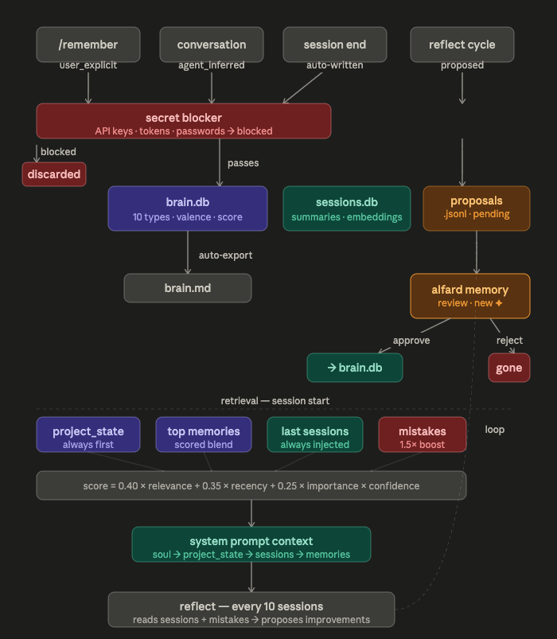

---

## What is Alfard?

Alfard is an open-source local AI agent runtime built around one idea: you should always know what your agent is doing, and always be able to stop it.
Every agent has a persistent typed memory that gets smarter the longer you use it — ten categories, scored by relevance and importance, with a reflection cycle that proposes improvements you review before they take effect. Your credentials are encrypted at rest in your OS keychain. Every tool call, gate decision, and session event is logged. Before anything irreversible happens, Alfard stops and asks. That confirmation is recorded. Nothing runs silently, nothing leaves your machine.
Connect it to Gmail, Notion, GitHub, Linear, Telegram, Discord. Talk to it from your terminal or your phone. It's the same agent, same memory, same rules — everywhere.

---

## What can you do with it?

**PR review pipeline**
Connect GitHub, Slack, and Notion. Set a cron job to run every hour. When a new pull request lands, your agent reads the diff, reviews the code, and posts a structured audit to your Slack — what changed, what looks risky, what questions it has. You reply with a single approval. The agent creates a tracked task in your Notion board so nothing falls through.

**Client enquiry intake**
Connect Gmail and Notion. When clients send unformatted requests, your agent reads the email, extracts key details, and formats them into a clean entry. Before touching anything, it sends you an approval request in Slack with exactly what it's about to log. One confirmation and it writes the record to your Notion database — client name, request type, priority, notes attached.

**Daily engineering standup brief**
Connect GitHub, Linear, and Slack. Schedule your agent at 8am every weekday. It reads all PRs opened in the last 24 hours, checks which Linear tickets moved, and posts a concise brief to your team Slack channel. Your team starts the day with context instead of a catch-up call.

**Release notes from merged PRs**
Connect GitHub and Notion. Tell your agent: *"summarise every PR merged to main since the last tag and draft release notes."* It reads the full diff history, groups changes by type — features, fixes, breaking changes — and drafts a structured Notion page. You review, edit freely, and publish when you're happy.

---

## Why Alfard?

There are other agent frameworks.  Alfard is built differently — security and transparency are the architecture, not features bolted on after the fact.

**You confirm every irreversible action.**
The approval gate cannot be accidentally left off. When an agent wants to send an email, close a ticket, post a message, or write to a file, execution halts and you see the full details — tool name, arguments as formatted JSON, source. You type `y` or `n`. On Telegram it's an inline keyboard. On Discord it's a button embed. The decision is logged either way. The agent cannot proceed without you.

**Your credentials are encrypted, not sitting in a text file.**
API keys are stored at `~/.alfard/.env.enc`, encrypted with Fernet (AES-128-CBC + HMAC-SHA256). The encryption key lives in your OS keychain — macOS Keychain, Linux Secret Service, Windows Credential Manager. If you upgrade from a version that stored keys in plaintext, Alfard migrates and deletes the plaintext file automatically on first run. Adding a new key never overwrites an existing one.

**Everything is audited.**
Every LLM call, tool execution, gate decision, and session event is written to `~/.alfard/logs/audit.jsonl` with a UTC timestamp and session ID. Every prompt injection warning is logged. Every memory proposal review is logged. Run `alfard log` to see your full history. There are no silent actions.

**Web content cannot hijack your agent.**
Three independent layers: an output sanitiser that strips injection phrases and system blocks from every tool result before it enters context; a behavioural gate that fires on any action taken after a web fetch, regardless of whether that action is reversible; and a strip safety net that catches faked Alfard UI elements injected by malicious pages before they print. All three run unconditionally.

**Agents remember — and you control what they learn.**
The memory system has ten typed categories (facts, preferences, goals, project state, procedures, mistakes, tool patterns, decisions, people, constraints), each with confidence, importance, and valence. Every 20 messages, every 30 minutes idle, and every 10 sessions, Reflect analyses recent conversations and proposes memory improvements. Those proposals sit in a review queue. You approve or reject each one before it shapes how the agent behaves. Rejected proposals are permanently blocked from re-surfacing.

**It works with any LLM, including local ones.**
OpenRouter, OpenAI, Anthropic, Ollama, LM Studio — switch providers at any time. Your data never has to leave your machine even for inference.

---

## Features

- **Interactive menu** — run `alfard`, navigate everything with arrow keys. Agents, channels, integrations, skills, mounts, cron jobs, memory, settings.
- **Multi-channel** — terminal, Telegram, Discord, and Slack run simultaneously from one command. Approval gate adapts per channel — inline keyboard on Telegram, button embed on Discord.
- **Headless + service mode** — `alfard headless <agent>` for VPS and homelab. `alfard service install <agent>` for systemd boot-time start and crash recovery.
- **Approval gate** — every irreversible action, every channel. Full arguments visible. Both outcomes logged.
- **Encrypted credentials** — Fernet + OS keychain. Merge-safe writes. Automatic plaintext migration.
- **Typed persistent memory** — 10 categories, valenced, scored. Reflect on three triggers. `recall_memory` tool for mid-conversation queries. Human-reviewed proposals.
- **Memory notifications** — after every confirmed brain.db write, a notification appears in the channel showing exactly what was remembered and as what type.
- **Default skills package** — every agent ships with 7 skills: `memory`, `tasks`, `projects`, `research`, `reasoning`, `communication`, `debugging`.
- **Three-layer prompt injection protection** — output sanitiser, behavioural gate, notification strip safety net.
- **Full audit trail** — every event, timestamped, queryable. `llm_call`, `tool_call`, `gate_decision`, `prompt_injection_warning`, `user_correction` and more.
- **Real integrations** — Notion, GitHub, Linear, Slack via MCP. Gmail and Google Drive via OAuth. Web search via DuckDuckGo, Brave, or SearXNG.
- **Skills system** — markdown-defined, per-agent, composable. Add your own in `~/.alfard/skills/`.
- **Cron jobs** — schedule any agent task on a timer.
- **Slash commands** — `/new`, `/remember`, `/status`, `/skills`, `/reset`, `/model`, `/help` in every channel.
- **Soul wizard** — 5-section guided agent creation. Produces a structured `soul.md` on first run.
- **Local web dashboard** *(v0.2)* — full local UI for agents, runs, approvals, memory, integrations, and settings.

---

## Quick start

### Requirements

- Python 3.11+
- Node.js — required for Notion, GitHub, and Linear (MCP over stdio)
- `gws` CLI — required for Gmail and Google Drive ([SETUP COMING SOON]([https://docs.alfard.dev/integrations/gmail](https://github.com/waterduckpani/alfard/blob/master/README.md)))

### Install

```bash
# Recommended
pipx install alfard

# From source
git clone https://github.com/waterduckpani/alfard.git
cd alfard
pip install -e .
```

### Setup

```bash
alfard setup
```

6 steps: LLM provider and API key, integrations, your first agent, skills, cron jobs, final review. Everything written to `~/.alfard/` — nothing touches the repo.

### Launch

```bash
alfard
```


### Run your agent

```bash
alfard run <agent-name>
```

Alfard loads the agent's soul and memory, connects all configured channels and integrations, and starts listening. Talk to it in the terminal, or from Telegram, Discord, and Slack simultaneously.

### Other commands

```bash
alfard headless <agent>           # channels only, no terminal — VPS / homelab
alfard service install <agent>    # generate systemd unit file
alfard channel connect <name>     # connect a channel (Telegram / Discord / Slack)
alfard channel disconnect <name>
alfard connect <name>             # connect an integration (Gmail / Notion / GitHub...)
alfard disconnect <name>
alfard log                        # view the full audit trail
alfard cron                       # manage scheduled runs
```

Full CLI reference → [COMING SOON]([https://docs.alfard.dev/cli](https://github.com/waterduckpani/alfard/blob/master/README.md))

---

## Channels

| Channel | Status | Connect |
|---|---|---|
| Terminal | ✅ Built-in | Always available |
| Telegram | ✅ Stable | `alfard channel connect telegram` |
| Discord | ✅ Stable | `alfard channel connect discord` |
| Slack | ✅ Stable | `alfard channel connect slack` |

All channels run simultaneously from a single `alfard run` command. The approval gate works natively in each — inline keyboard on Telegram, button embed on Discord, prompt in terminal.

---

## Integrations

| Integration | Status | Connect |
|---|---|---|
| Notion | ✅ Stable | `alfard connect notion` |
| GitHub | ✅ Stable | `alfard connect github` |
| Linear | ✅ Stable | `alfard connect linear` |
| Web search (DDG / Brave / SearXNG) | ✅ Stable | Enabled in setup |
| Gmail | ⚠️ Experimental | `alfard connect gmail` — requires `gws` |
| Google Drive | ⚠️ Experimental | `alfard connect gdrive` — requires `gws` |

---

## Supported LLM providers

| Provider | Local | Notes |
|---|---|---|
| OpenRouter | No | Any model on the platform, including Claude, Gemini, and open models |
| OpenAI | No | `gpt-4o`, `gpt-4o-mini`, `o3-mini`, custom |
| Anthropic | No | `claude-sonnet-4-5`, `claude-opus-4-5`, `claude-haiku-4-5`, custom |
| Ollama | Yes | `llama3.2`, `mistral`, `qwen2.5-coder`, any local model |
| LM Studio | Yes | Any model loaded in LM Studio |

---

## Creating an agent

Run `alfard` and choose `create a new agent`. The soul wizard walks through five sections — identity, expertise, communication style, uncertainty behaviour, and optional context about you. It writes a structured `soul.md` and adds the default skills package automatically.

You can also write `soul.md` directly. It's plain markdown:

```markdown
# postman

## Purpose
You manage email. You read, triage, draft, and send via Gmail.
You never send without explicit user approval.

## Personality
Efficient and direct. Summarise threads in bullet points.

## Rules
- Always show a draft before calling gmail_send_message.
- Mark threads read only after the user confirms.
- Flag anything from investors or customers as high priority.
```

---

## Memory

Alfard's memory system stores context that persists across every session — not just the last conversation.

Ten typed categories: `fact` · `preference` · `goal` · `project_state` · `procedure` · `mistake` · `tool_pattern` · `decision` · `person` · `constraint`

Each memory has a confidence score, importance weight, and valence. Retrieval blends relevance, recency, and importance. `project_state` always surfaces first. Agents can query memory mid-conversation using the `recall_memory` tool — not just at session start.

Reflect fires on three triggers — every 20 messages, every 30 minutes idle, every 10 sessions — and proposes improvements based on patterns it finds. You review and approve each proposal before it writes to memory. Rejected proposals never come back.



### Memory notifications

After every confirmed write to `brain.db`, a notification appears in the active channel showing exactly what was remembered and as what memory type.


On Discord it's a small embed. On Telegram it's a separate message after the agent reply. On Slack it's a muted italic follow-up. In the terminal it's a `╭─ remembered ─╮` panel. Only fires for writes with a confirmed source — never for internal housekeeping.

---

## Architecture

All user data lives in `~/.alfard/`:

```
~/.alfard/
├── .env.enc               # API keys — Fernet-encrypted, key in OS keychain
├── config/
│   ├── alfard.yaml        # provider, model, approval gate settings
│   └── integrations.yaml  # connected channels and integrations
├── agents/
│   └── <name>/
│       ├── soul.md        # agent personality and rules
│       ├── skills.yaml    # active skills for this agent
│       ├── brain.db       # memory store (SQLite + vectors)
│       ├── memory/        # embeddings + proposals.jsonl
│       └── crons.yaml     # scheduled tasks
├── skills/                # your custom skills
└── logs/
    ├── audit.jsonl        # full audit trail — append-only
    └── cron_jobs.sqlite
```

Nothing is ever written to the Alfard repo directory.

---

## Security

Security is the architecture, not a feature layer. See [SECURITY.md](SECURITY.md) for the complete model.

- **Approval gate** on every irreversible action, across every channel — cannot be bypassed
- **Encrypted credentials** at rest — Fernet + OS keychain, automatic plaintext migration
- **Three-layer prompt injection protection** — sanitiser, behavioural gate, strip safety net
- **Full audit trail** — every event logged, credentials never in arguments
- **Memory secret blocking** — API keys, tokens, and passwords blocked before any brain.db write
- **Channel allowlists** — Telegram and Discord require explicit user/guild whitelists
- **No telemetry** — nothing phones home

To report a vulnerability, see [SECURITY.md](SECURITY.md#responsible-disclosure). Please do not open a public issue.

---

## Roadmap

- [ ] Local web dashboard — full local UI *(v0.2)*
- [ ] Agent-to-agent communication
- [ ] Docker opt-in sandbox for code execution
- [ ] WhatsApp channel
- [ ] Bundled Gmail OAuth — no GCP setup required

Follow progress and vote on features → [GitHub Discussions](https://github.com/waterduckpani/alfard/discussions)

---

## Contributing

Contributions are welcome. See [CONTRIBUTING.md](CONTRIBUTING.md) for dev setup, how to add a channel or integration, running the test suite, and the PR process.

Please read the [Code of Conduct](CODE_OF_CONDUCT.md) before contributing.

---

## License

MIT — see [LICENSE](LICENSE).

---

<div align="center">
  Built by <a href="https://github.com/waterduckpani">Bharat Khanna</a>
  <br><br>
  If Alfard is useful to you, a ⭐ on GitHub goes a long way.
</div>
